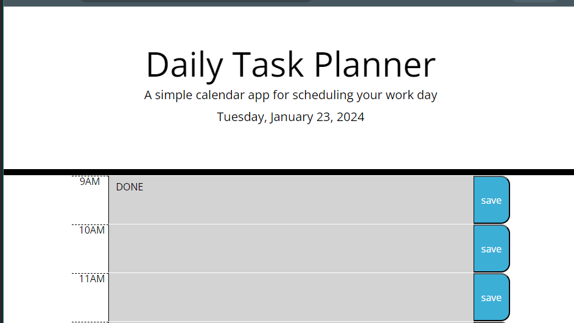

# daily-task-planner

## Description

The JavaScript code I've crafted establishes a functional daily task planner, harnessing the capabilities of the jQuery and dayjs libraries. I kick off by displaying the current day in the planner's header, thanks to dayjs's date formatting. The core functionality lies in dynamically generating time blocks for standard business hours, integrating hour columns, text areas for input, and save buttons.

These time blocks are intelligently colour-coded, distinguishing between past, present, and future hours based on a comparison with the current time. Moreover, my code incorporates local storage to persistently store and retrieve events associated with each time block. When you enter an event and click the 'Save' button, the corresponding text is stored in the browser's local storage with a structured key. This feature ensures you can maintain a record of your daily tasks even after refreshing the page.

Throughout the developmental process, I gained valuable insights into employing jQuery for efficient DOM manipulation, handling time-related functionalities using dayjs, and leveraging local storage to maintain user data within the browser. The strategic use of jQuery and dayjs underscores my deliberate choice to incorporate third-party libraries, streamlining specific aspects of the application's functionality.

## Table of Contents

-   [Installation](#installation)
-   [Usage](#usage)
-   [Credits](#credits)
-   [License](#license)ation

N/A

## Usage

[You can view the website via this link](https://)

The following animation demonstrates the application functionality:

## Animated gif

-   

## Screenshots

-   
-   
-   
-   
-   

## Credits

-   Tutoring session
-

### List of third-party assets.

-   jQuery: https://jqueryui.com/sortable/#placeholder
-   Day.js: https://day.js.org/docs/en/display/format

## License

-   Please refer to the repo
